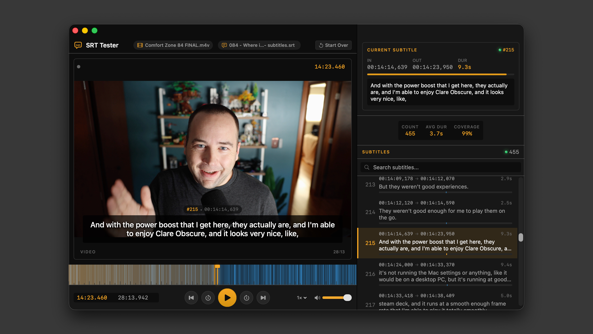

# SRT Tester

A simple Mac app for testing SRT subtitle files. Built for developers and creators who generate subtitles and want to quickly preview how they'll look and sync with their video or audio before delivering to users.

## Usage

1. Drag a video or audio file onto the left drop zone (MP4, MOV, MP3, WAV, AIFF)
2. Drag an SRT file onto the right drop zone
3. Use the playback controls to review subtitle timing

**Keyboard shortcuts:**
- Space - Play/Pause
- Left/Right arrows - Skip 5 seconds
- Up/Down arrows - Jump to previous/next subtitle

## Building

Requires macOS 14+ and Xcode 15+.

1. Open `SRT Tester.xcodeproj` in Xcode
2. Build and run (Cmd+R)
